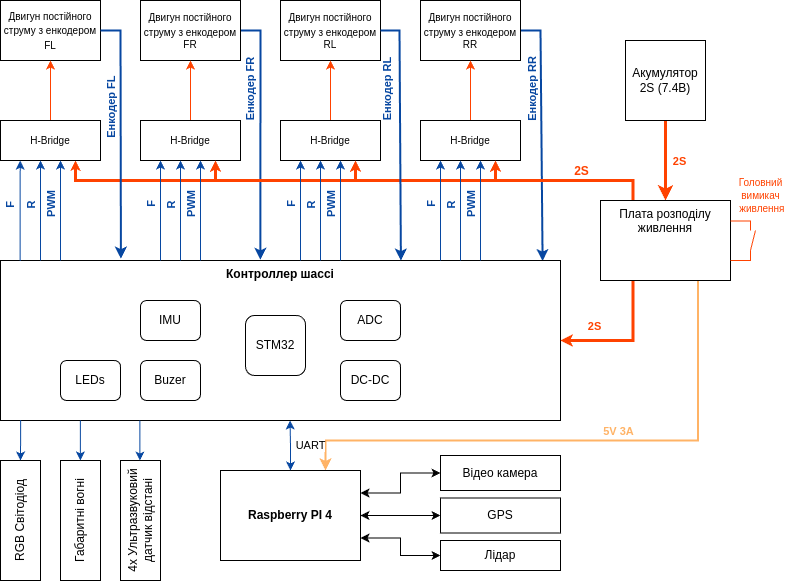

  

## Main components

### Motors

Since we don't require high speed or the ability to carry a heavy load, the JGB37-520-256RPM motors are perfectly suitable for us.
These are 6V DC motors with a built-in gearbox and encoder. The maximum wheel rotation speed is 256 revolutions per minute. With a wheel diameter of 87 mm, the robot’s maximum speed can reach up to 4 km/h.
These motors are sold as a set with wheels and convenient motor mounts for attaching to the chassis. The maximum current consumption is 0.33 A.

### Motor control module (H-Bridge)

The Dual H-Bridge L298N motor driver module allows control of two DC motors or one stepper motor. It supports a voltage range from 5V to 35V and a maximum current of up to 2A per channel. The module is equipped with overheat protection and allows control of motor direction and speed using Pulse Width Modulation (PWM).
