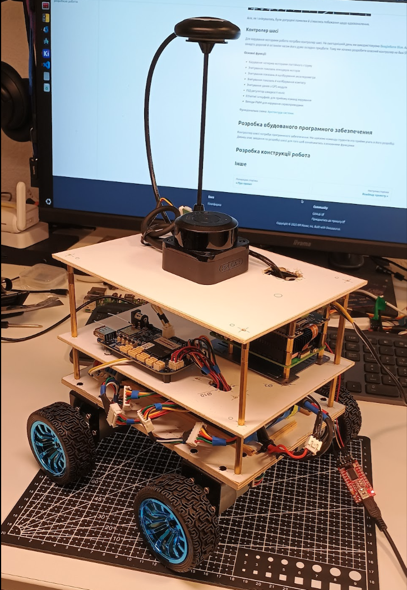

import YouTubeVideo from '@site/src/components/youtube';

# Tasks
Here you can find a list of tasks that you can choose for yourself.

## Embedded software development

The chassis controller requires a STM32 software. We're looking for a students team, who will participate in it's development.
See the chassis design task description for basic functionality.

## Robot design development
At the first stage, we've decided to make the design as simple as possible, so that the assembly wouldn't reqiure special tools and the materials could be purchased easily and inexpensively. Therefore, our robot now looks like this: 

In this design, the main disadvantage of this robot - he cannot be used in bad weather conditions. Also, the chassis has poor cross-country ability due to lack of suspension.

We're looking for students, who can design, print and assemble a modern robot chassis for this project.

Here's an example of a good open source project:

<YouTubeVideo videoId="90HxqwZaWRA" />

## ROS2 Software Development
The robotic arm requires ROS2-based software. We are looking for a student team to participate in its development and configuration. See the robotic arm task description for the basic functionality.

