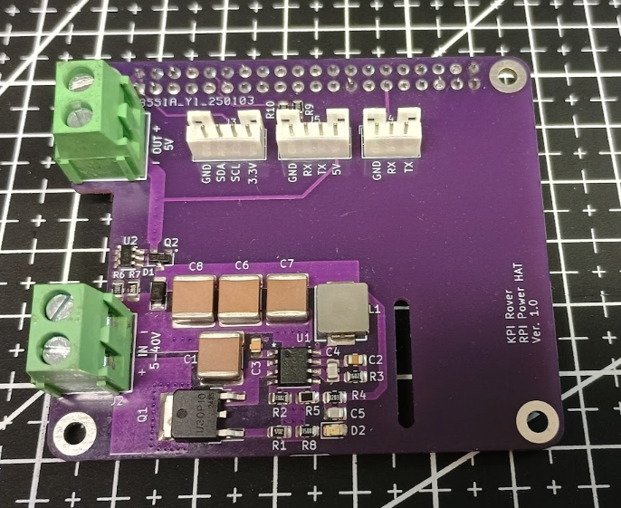

import YouTubeVideo from '@site/src/components/youtube';

# Завдання
Тут ви можете знайти перелік завдань, серед яких ви можете обрати завдання собі.

## Розробка електроніки

Ми шукаємо студентів, котрі мають бажання взяти участь у розробці друкованих плат.
Для розробки друкованих плат ми використовуємо [**KiCAD**](https://www.kicad.org/)

### Плата живлення Raspberry Pi
Живлення Raspberry Pi від акумулятора потребує стабільного й доволі потужного DC-DC перетворювача.

Ми вже розробили перший прототип:

Але, як і очікувалось, були допущені помилки й з'явились побажання щодо вдосконалення.

### Контролер шасі

Для керування моторами робота потрібен контролер шасі. На сьогоднішній день ми використовуємо [BeagleBone Blue](https://www.beagleboard.org/boards/beaglebone-blue). Але він занадто дорогий й останнім часом його дуже складно придбати. Тому ми хочемо розробити власний контролер на базі STM32.

**Основні функції:**
* Керування чотирма моторами постійного струму
* Зчитування показань енкодерів моторів
* Зчитування показань й калібрування акселерометра
* Зчитування показань й калібрування компаса
* Зчитування даних з GPS модуля
* ПІД регулятор швидкості коліс
* Ethernet інтерфейс для прийому команд керування
* Виходи PWM для керування сервоприводами.

Функціональна схема: [Архітектура системи](../system/architecture).

На першому етапі, так як є ризик зробити багато помилок, ми плануємо розробити плату у вигляді плати розширення до STM32-Discovery. Потім, коли ми вже здобудемо досвід, ми плануємо розробити повноцінну плату з встановленим на ній мікроконтролером STM32.

## Розробка вбудованого програмного забезпечення 

Контролер шасі потребує програмного забезпечення для STM32. Ми шукаємо команду студентів, які візьмуть участь у його розробці.
Дивись опис завдання по розробці шасі для того, щоб ознайомитись з основними функціями.

## Розробка конструкції робота
На перщому єтарі ми вирішили зробити як умога просту конструкцію, щоб збірка не потребувала спеціалтних знарядь а мптеріали можно було легко й недорого придбати. Тому наш робот зараз виглядає ось так:

У цієї конструкції основний недолік - цого робота неможна використовувати на дворі при поганих погодних умовах. Також це шассі має погану проходімість так як нема підвіски. 

Ми шукаємо группу студентів котра зможе розробити, надрукувати й зібрати для проєкту сучасне шассі робота.

Ось приклад непоганого opensource проєкту:

<YouTubeVideo videoId="90HxqwZaWRA" />

## Інше
TODO GitActions and Process definition