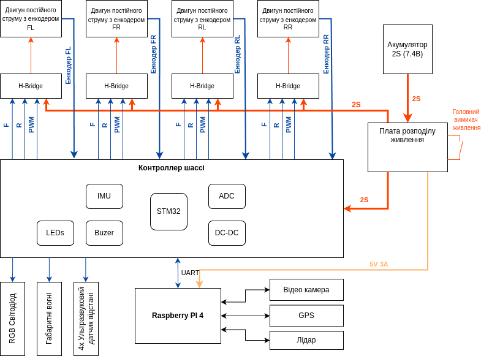
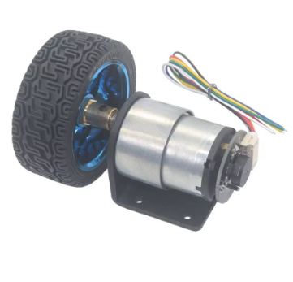
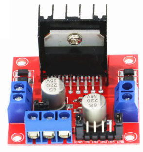

# Функціональна схема

## Основні компоненти
### Двигуни

Оскільки нам не потрібна велика швидкість і нам не потрібно перевозити велику вагу, нам цілком підходять мотори JGB37-520-256PRM.
Це мотори постійного струму на напругу 6В зі вбудованим редуктором та енкодером. Максимальна частота обертання коліс — 256 обертів за хвилину. При діаметрі колеса 87 мм максимальна швидкість робота може становити 4 км/год.
Ці мотори продаються в комплекті з колесами та зручним кріпленням моторів до шасі. Максимальний споживаний струм — 0.33А.

### Модуль керування мотором (H-Bridge)

Модуль керування двигунами Dual H Bridge L298N дозволяє керувати двома двигунами постійного струму або одним кроковим двигуном. Він підтримує напругу від 5В до 35В і максимальний струм до 2А на канал. Модуль оснащений захистом від перегріву та має можливість керування напрямком і швидкістю обертання двигунів за допомогою широтно-імпульсної модуляції (ШІМ).

